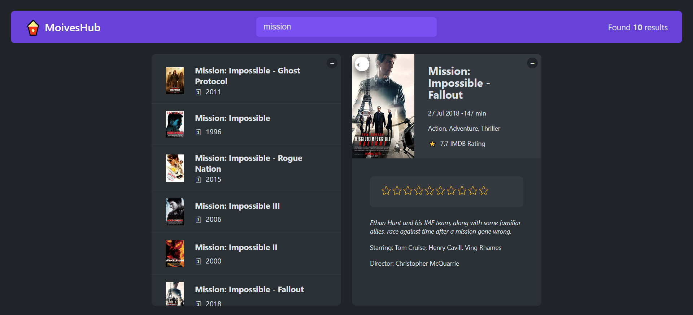

<br/>
<p align="center">
  <a href="https://github.com/rajsinghast03/moviesHub">
    
  </a>

  <h3 align="center">MoviesHub</h3>

  <p align="center">
    An Awesome movie rating website!
    <br/>
    <br/>
  </p>
</p>


## About The Project



A movie rating website where user can search for a movie and can rate the movie on a scale of 1-10 according to their taste. They can even add the movie to their watch list.


### Prerequisites


* npm

```sh
npm install npm@latest -g
```

### Installation

1. Get a free API Key at [https://www.omdbapi.com/apikey.aspx]

2. Clone the repo

```sh
git clone https://github.com/rajsinghast03/moviesHub.git
```

3. Install NPM packages

```sh
npm install
```
4. Create a .env file in the root directory of project

5. Enter your API_KEY in `.env` as

```JS
REACT_APP_API_KEY="YOUR_API_KEY";
```

## Contributing

Contributions are what make the open source community such an amazing place to be learn, inspire, and create. Any contributions you make are **greatly appreciated**.
* If you have suggestions for adding or removing projects, feel free to [open an issue](https://github.com/rajsinghast03/moviesHub/issues/new) to discuss it, or directly create a pull request.

### Creating A Pull Request

1. Fork the Project
2. Create your Feature Branch (`git checkout -b feature/AmazingFeature`)
3. Commit your Changes (`git commit -m 'Add some AmazingFeature'`)
4. Push to the Branch (`git push origin feature/AmazingFeature`)
5. Open a Pull Request


